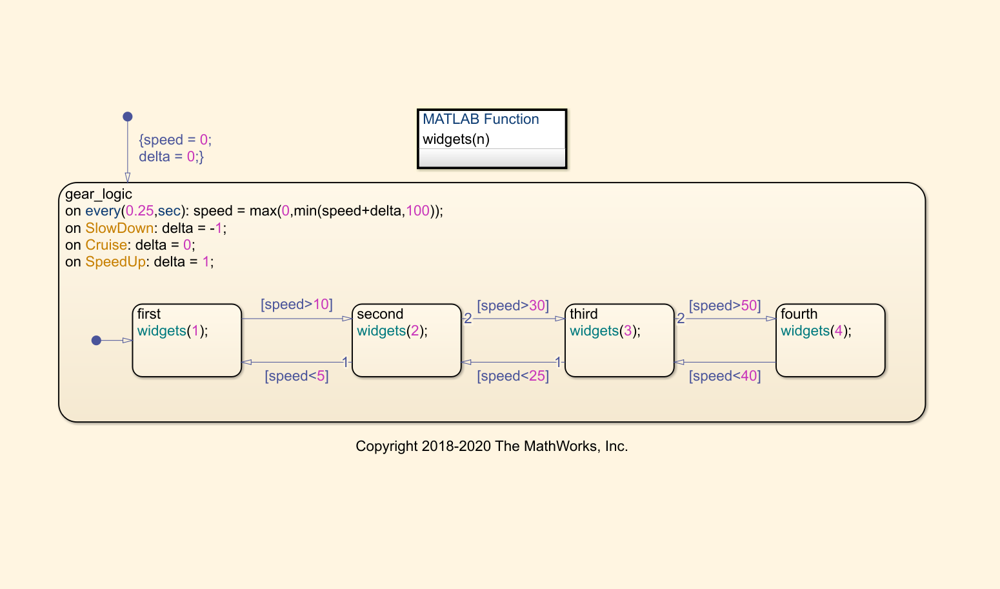
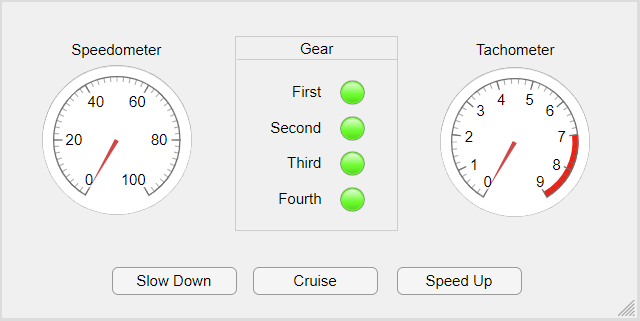
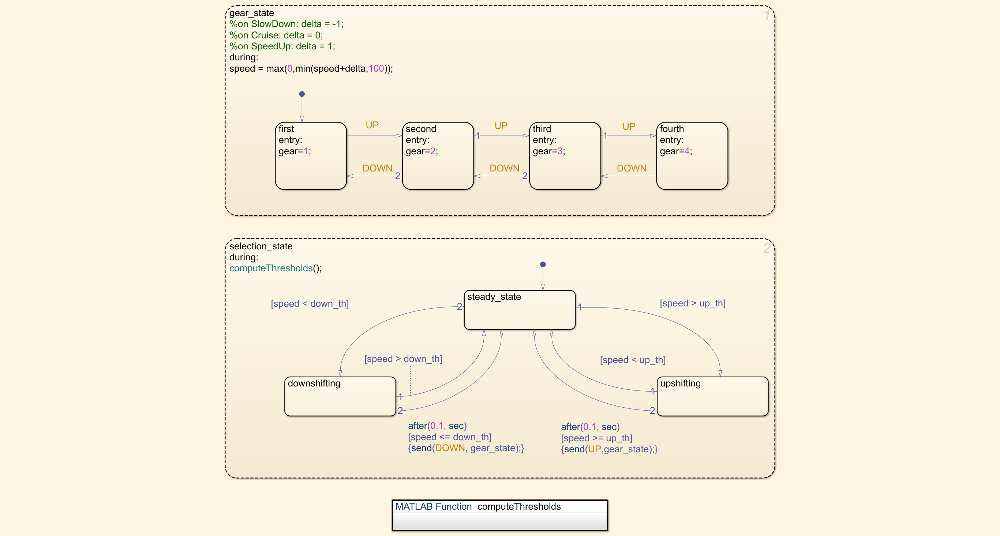

# Simulink-Stateflow implementation of the Gear Logic

## 🏗 The Starting Point

Running the following `MATLAB` command:

```Matlab
cd(setupExample('stateflow/ExecuteStateflowChartObjectGettingStartedExample')); edit sf_car_standalone.sfx; edit sf_car_dash
```

|  |
| :---------------: |
|  |


We will see a **Standalone** Stateflow Chart which represents exaclty the starting point that we need.
This kind of charts enable us to trigger the events manually during the simulation, but unfortunately they cannot interact with any other Simulink blocks. Furthermore, for our puporse we don't need a GUI dashboard to interact with the system, because it is running on the HW board.


## 🛠 Model and Setup

With reference about what we have said above, we can modify the previous design a little bit, so that we can move it within a Simulink project (see the image below).


|  |
| :---------------: |
| Stateflow Chart of the Gear logic (🔘 click on the image to enlarge) |

**Note**:

Without a Standalone Staflow project we can't benefit of the `Call Event Method` to trigger the events manually. Thus, we need to cover each case setting the initial value of the `delta` variable manually.