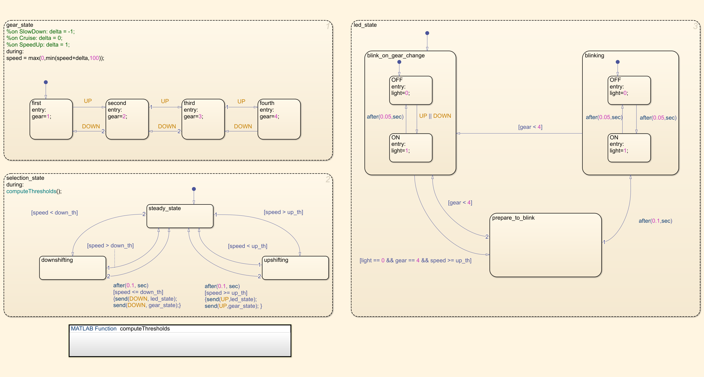

# Implementing the LED feedback logic

## 🛠 Model and Setup

In this step we are implementing a LED feedback logic in order to detect when the system reach the maximum speed with the last gear selected.

|  |
| :---------------: |
|  |

**Note**

The Simulation starts with the `gear` initial value equal to `1`. Thus you will se 3 pulses instead of 4.
Moreover, we intentionally added a dummy transition state between `blink_on_gear_change` and `blinking` states so we can obtain a better visualization of the 3rd gear change.