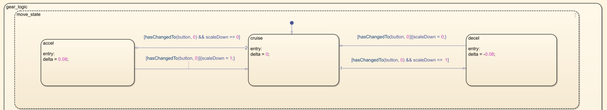
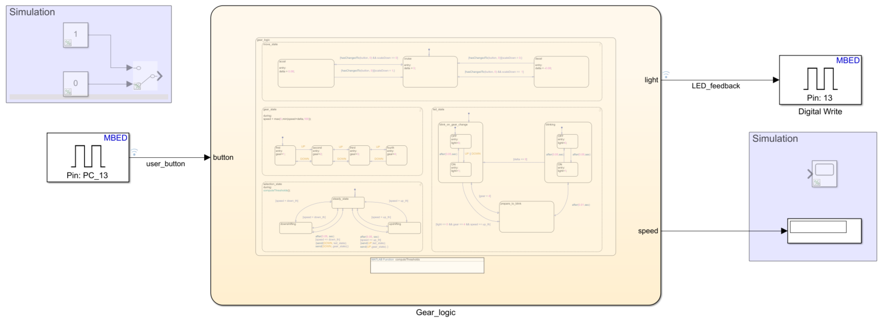

# Code generation and deployment on STM32 Nucleo

## Introduction
This the last step of out project. Here we want to introduce the possibility for the user to manage the acceleration of the car. This task can be achived using the `USER_BUTTON` available on STM32.
More specifically we would give the possibility to the user to accelerate, cruise, and decelerate the speed of the car.

## ⚙ Configuation Settings

Simulink Coder Support Package for STMicroelectronics Nucleo Boards enables you to create and run Simulink models on supported STMicroelectronics Nucleo boards. The support package includes a library of Simulink blocks for configuring and accessing STMicroelectronics Nucleo peripherals and communication interfaces.

> **Note**
Under the `target Hardware resources` section, we need to setup the `external mode` to the right COM port where our board is attached to.
For Windows user we can find this parameter on `Device Manager`.

This is the most important step of our project.
In order to accomplish it, we need to [Configure Model for Code Generation and Download](https://www.mathworks.com/help/supportpkg/nucleo/ug/getting-started-with-simulink-coder-support-package-for-stmicroelectronics-nucleo-boards.html).

- Since, the Gear logic outputs the value `LED_off / LED_on`, we use this command value to interact with the physical LED of the STM32 Nucleo board.
- On the Nucleo L476RG board, the user LED and Button are driven by the GPIO Pin `13` and `PC_13` respectively.

## 🛠 Model and Setup

In order to manage the input coming from Simulink, we introduced a further paraellel state machine.

In this implementation we made use of the [Change Detection Operator](https://www.mathworks.com/help/stateflow/ug/detecting-changes-in-data-values.html) to generate an implicit local event when the chart sets the value of a variable. This variable is driven by the user button (default high).

> **Note**
If you don't have a STM32 Nucleo board handy, you still have the possibily to simulate the model using a __virtual__ button from Simulink libraries and insped the data coming out from the 'Gear_logic' (see the purple rects).

## 🏁 Monitor Signals and Tune Parameter on Simulink

If we want to inspect what is happening on the board, we can deploy the model on the Nucleo and check the signals that it produces.
Looking at the following video demostration we can have an idea of what we are talking about:

https://user-images.githubusercontent.com/18039045/128365932-74f889ef-dba3-4c35-8450-e8a4dcfe52ad.mov

