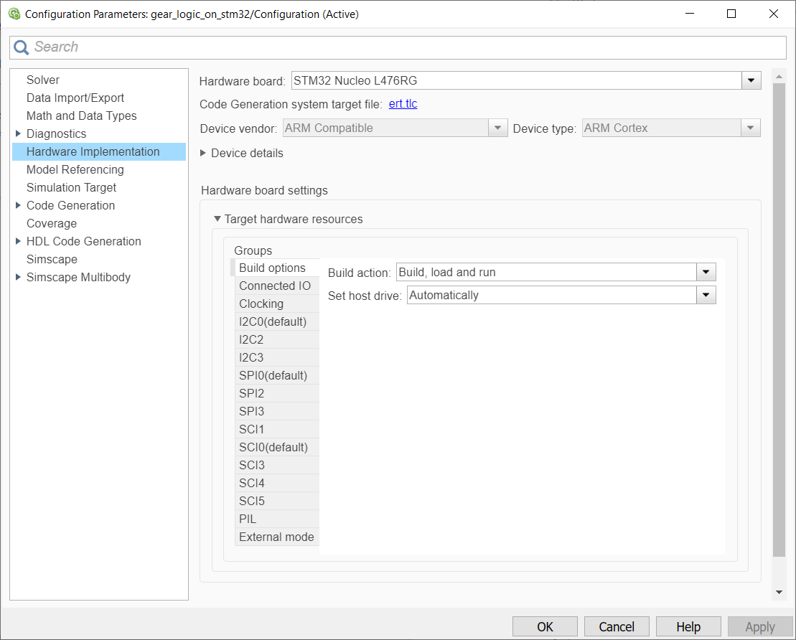

# Code generation and deployment on STM32 Nucleo

Simulink Coder Support Package for STMicroelectronics Nucleo Boards enables you to create and run Simulink models on supported STMicroelectronics Nucleo boards. The support package includes a library of Simulink blocks for configuring and accessing STMicroelectronics Nucleo peripherals and communication interfaces.

## 🛠 Model and Setup

This is the most important step of our project.
In order to accomplish it, we need to [Configure Model for Code Generation and Download](https://www.mathworks.com/help/supportpkg/nucleo/ug/getting-started-with-simulink-coder-support-package-for-stmicroelectronics-nucleo-boards.html).

- Since, the Gear logic outputs the value LED_off / LED_on, we use this command value to interact with the physical LED of the STM32 Nucleo board.

- The user LED is driven by GPIO Pin 13 on the Nucleo L476RG board. The user LED might be driven by a different Pin on different Nucleo boards.

